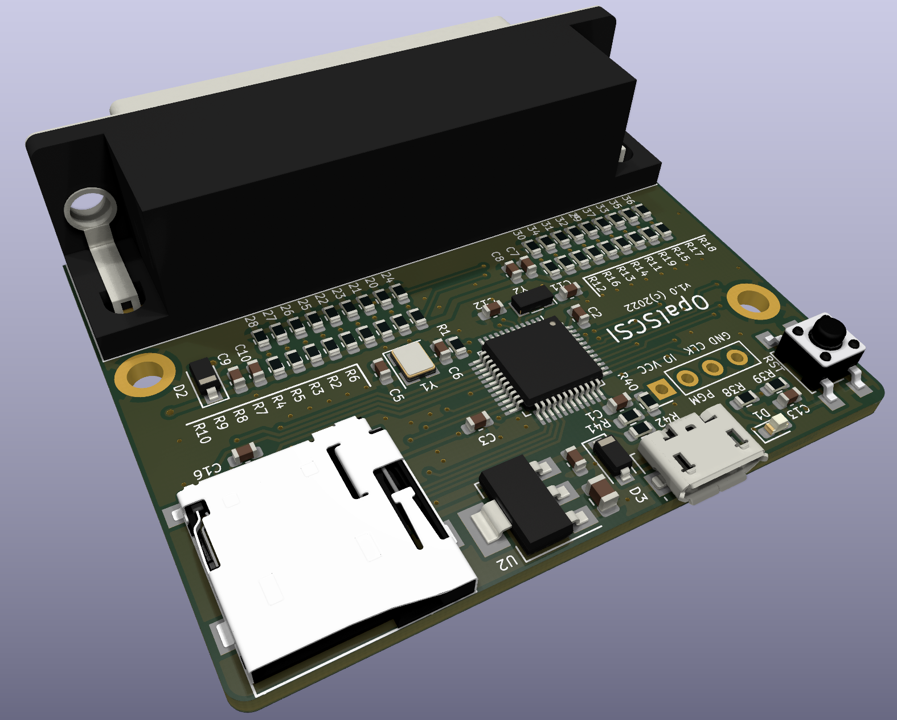
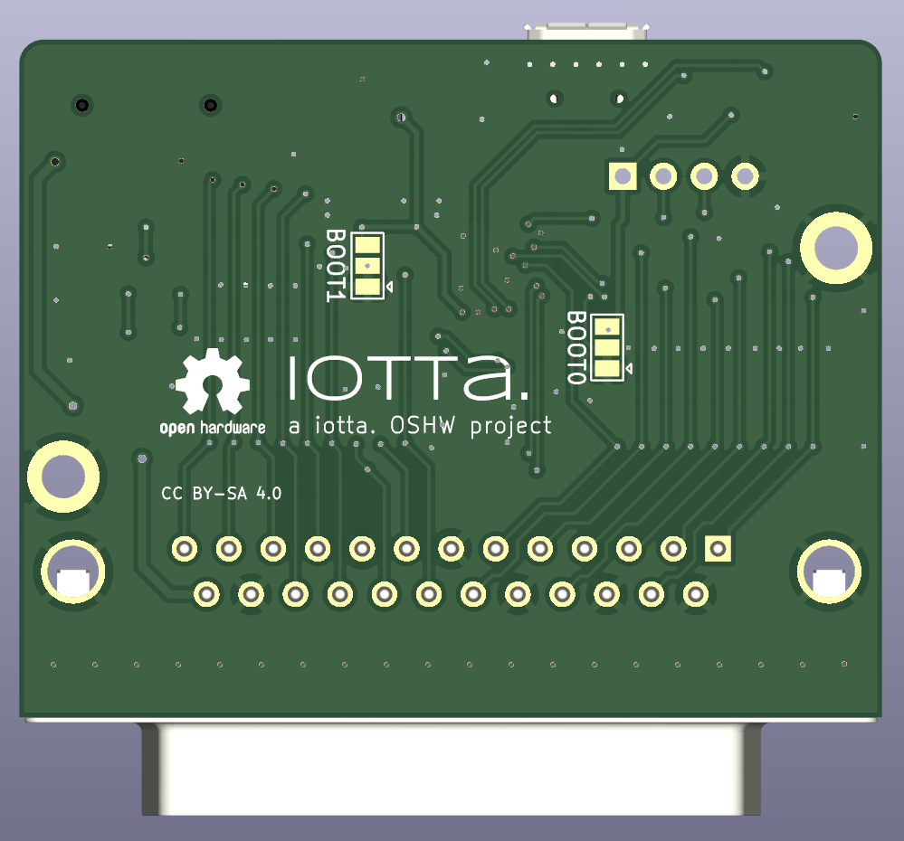
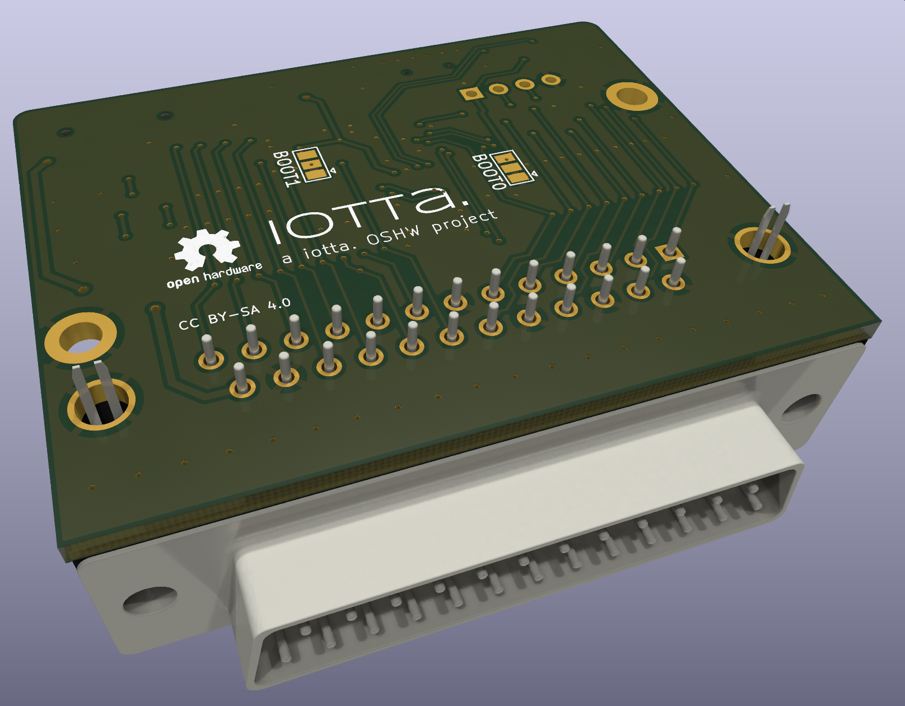
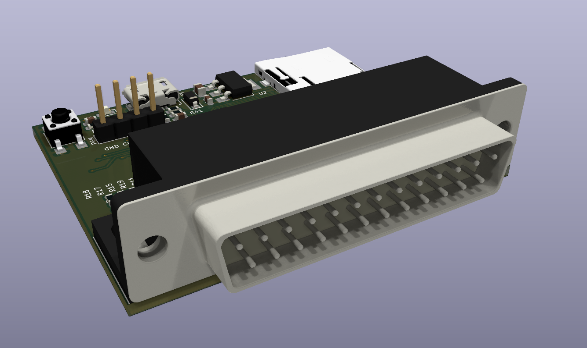
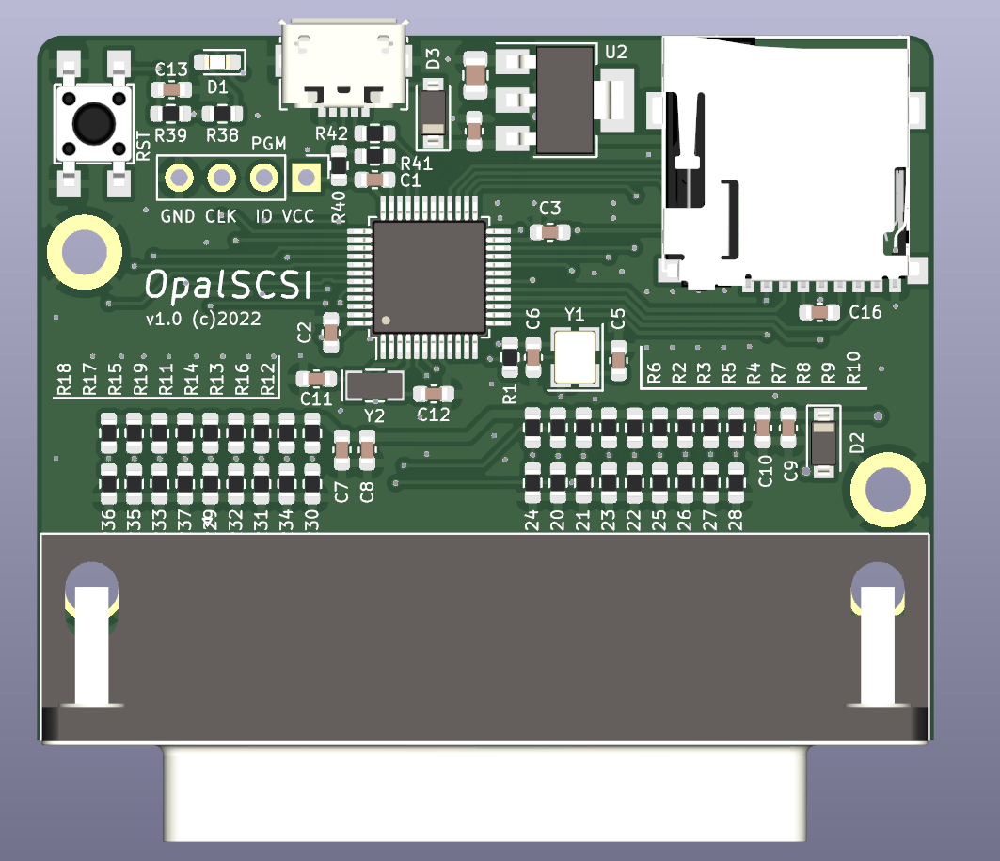

# OpalSCSI

Nice, tidy and small BlueSCSI-compatible dongle made to fit classic Macintosh computers. (But probably fits a whole lot more machines sporting a DB-25 SCSI connector!)

## Background

I found an old Macintosh 512k lying around and obviously ~~wanted~~ needed to boot it. It did come with a (rather large) box containing a SCSI drive, but unfortunately/unsurprisingly it did not stand the test of time.. 🥹
So with no apparent way to be able to boot my Mac and no appetite to fiddle with old SCSI drives I stumbled upon the great BlueSCSI project! I loved the project and decided build some hardware to go with the firmware. The design for this is what you find in this repository.
I had all components needed and I did not want to fiddle with loose (dupont) wiring to a bluepill or SCSI cabling or whatever. Therefore decided to build a small dongle board that takes a SD-card and directly plugs into the computer.

## Some nice pictas

<!--  -->
<!--  -->

## Get one of my boards!

I've had some (5) boards produced and soldered 2 devices together for own use. As I still have some boards lying around, you can get one at shipping cost! 🥳 Just create an issue here with the request, I'll probably pick it up.. :)
